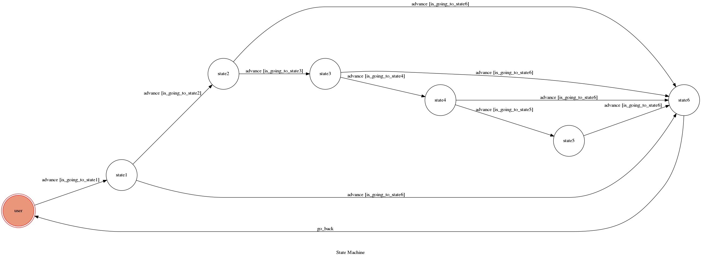

# TOC Project 2017

Template Code for TOC Project 2017

A telegram bot based on a finite state machine

## Setup

### Prerequisite
* Python 3

#### Install Dependency
```sh
pip install -r requirements.txt
```

* pygraphviz (For visualizing Finite State Machine)
    * [Setup pygraphviz on Ubuntu](http://www.jianshu.com/p/a3da7ecc5303)

### Secret Data

`API_TOKEN` and `WEBHOOK_URL` in app.py **MUST** be set to proper values.
Otherwise, you might not be able to run your code.

### Run Locally
You can either setup https server or using `ngrok` as a proxy.

**`ngrok` would be used in the following instruction**

```sh
ngrok http 5000
```

After that, `ngrok` would generate a https URL.

You should set `WEBHOOK_URL` (in app.py) to `your-https-URL/hook`.

#### Run the sever

```sh
python3 app.py
```

## Finite State Machine


## Usage
The initial state is set to `user`.

* user
	* Input: "birth"
		* Reply: "I am a baby."

	* Input: "dead"
		* Reply: "I am dead."
* baby
	* Input: "grow up"
		* Reply: "I am a kid."

	* Input: "dead"
		* Reply: "I am dead."
* kid
	* Input: "play with friends"
		* Reply: "I am a teenager."

	* Input: "dead"
		* Reply: "I am dead."
* teenager
	* Input: "absorb knowledge"
		* Reply: "I am an adult."

	* Input: "dead"
		* Reply: "I am dead."
* adult
	* Input: "work work work"
		* Reply: "I am an elderly."

	* Input: "dead"
		* Reply: "I am dead."
* elderly
	* Input: "dead"
		* Reply: "I am dead."
## Author
boys9033(http://github.com/boys9033/TOC-Project-2017)
